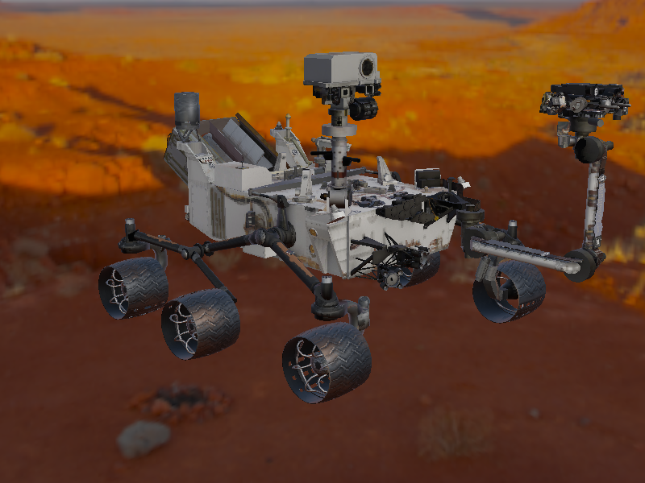
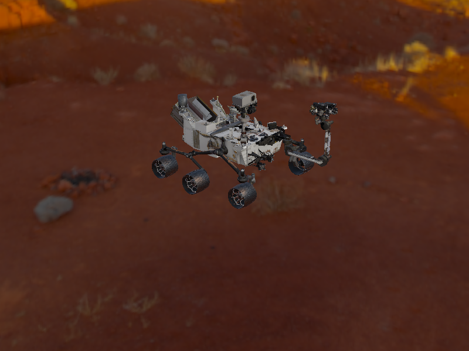

# PBRCuriosity

Java OpenGL 4.6 PBR render Curiosity with Deferred Shading. Model from official [site](https://solarsystem.nasa.gov/resources/2398/curiosity-3d-model/), without modifications (only extracted from gltf).

Input mapping:

```
WASD - rotate camera
QE - change zoom
ZX - move camera up/down
F - save screenshot
Esc - exit
```

Some screens:


Screens from program:





